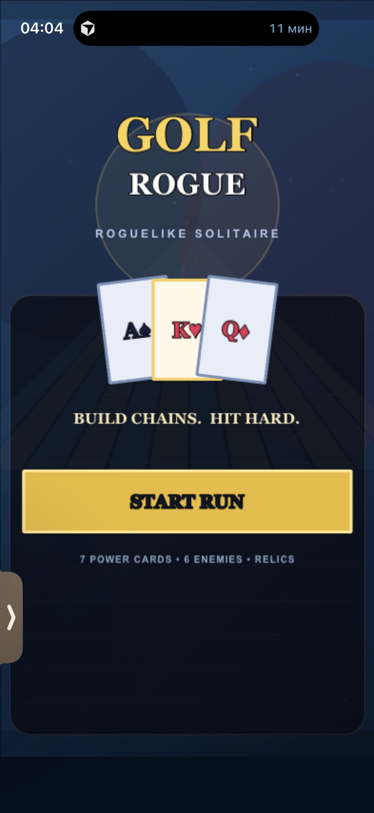
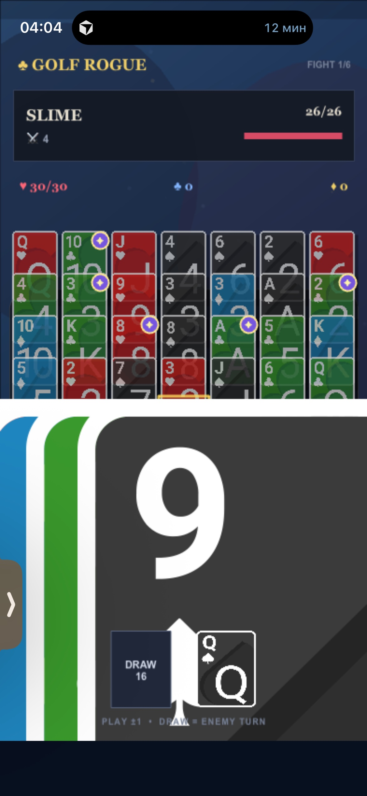

# Golf Rogue — Аудит кодовой базы

**Дата:** 2026-09-25  
**Версия репозитория:** начальный коммит

---

## 1. Обзор проекта

### 1.1 Стек и технологии

| Компонент | Технология | Файл |
|-----------|------------|------|
| Game Engine | Phaser 3.90.0 | `package.json` |
| Язык | TypeScript 5.9.2 | `tsconfig.json` |
| Сборщик | Vite 7.1.7 | `vite.config.ts` |
| PWA | vite-plugin-pwa 1.0.3 | `vite.config.ts` |
| Деплой | Vercel | `vercel.json` |

### 1.2 Структура файлов

```
/workspace
├── src/
│   ├── main.ts          # ВСЯ игра в одном файле (~350 строк minified)
│   └── style.css        # Базовые стили
├── public/
│   ├── assets/
│   │   ├── cards/       # 52 SVG карты (AC.svg - KS.svg)
│   │   └── enemies/     # 6 SVG врагов (slime, bandit, knight, mimic, witch, king)
│   ├── manifest.webmanifest
│   └── icon.svg
├── index.html
├── package.json
├── vite.config.ts
└── tsconfig.json
```

### 1.3 Точки входа

- **HTML:** `index.html` → `<div id="game">` → `src/main.ts`
- **Phaser Scene:** единственная сцена `Game` создаётся в конструкторе `Phaser.Game`
- **Запуск:** `npm run dev` → Vite dev server

### 1.4 Владение состоянием

Всё состояние живёт в полях класса `Game extends Phaser.Scene`:

```typescript
cols: Card[][] = [];           // tableau 7x5
deck: Card[] = [];             // колода
waste!: Card;                  // активная карта
hp, maxHp, shield, gold        // игрок
floor, combo                   // прогресс
enemyHp, enemyMax, enemyAtk    // враг
wrap, spade, heal, coin, armor, boost  // эффекты реликвий
powerCards: Set<string>        // power-карты в текущем бою
powerTypes: Map<string, string> // тип power для каждой карты
```

**Проблема:** состояние смешано с рендерингом, нет разделения на model/view.

### 1.5 Реализация правил

Файл: `src/main.ts`

- **Создание колоды:** `makeDeck()` — создаёт 52 карты, shuffle
- **Раздача:** `startFight()` — 7 колонок × 5 карт, остальное в deck
- **Проверка хода:** `near(a, b)` — `|a - b| === 1` или wrap `|a - b| === 12`
- **Playable:** `isPlayable(i)` — последняя карта колонки near к waste
- **Взятие карты:** `play(i)` — pop из колонки, применить эффекты масти/power
- **Draw:** `draw()` — если combo > 0, враг атакует, затем берём карту из deck

### 1.6 Рендеринг

Метод `render()` полностью пересоздаёт все Phaser-объекты:
- `this.children.removeAll()` — удаляет ВСЁ
- Заново рисует фон, HUD, врага, tableau, кнопки

**Проблема:** нет анимаций между состояниями, всё мгновенно перерисовывается.

### 1.7 Анимации

Присутствуют:
- `flash()` — круг расширяется и исчезает
- `particles()` — частицы разлетаются
- `damageNumber()` — число урона поднимается
- Camera shake при ударах
- Tweens для idle-bounce врага и glow playable карт

**Отсутствуют:**
- Анимация перемещения карты от tableau к активной позиции
- Анимация атаки врага
- Анимации состояний врага (Idle/Anticipation/Hit/Attack/Death)

### 1.8 Конфигурация и баланс

Хардкод в коде:
```typescript
enemies = [
  ['SLIME', 26, 4],
  ['BANDIT', 38, 5],
  ['BONE KNIGHT', 52, 6],
  ['MIMIC', 66, 7],
  ['WITCH', 82, 8],
  ['GOLF KING', 110, 10]
] as [string, number, number][];
```

Реликвии хардкожены в `reward()`.

**Нет:** JSON/конфига для балансировки, data-driven подхода.

### 1.9 Сохранение

**Отсутствует.** Нет localStorage, нет persistence. При обновлении страницы прогресс теряется.

### 1.10 PWA

- `manifest.webmanifest` — корректный, portrait orientation
- Service Worker через vite-plugin-pwa с workbox
- iOS meta-теги в `index.html`

**Статус:** базовая PWA работает, можно добавить на домашний экран.

---

## 2. Gap-анализ относительно брифа

### Легенда
- ❌ **Отсутствует** — функционал не реализован
- ⚠️ **Частично/Сломано** — есть попытка, но не работает или неполная
- ✅ **Работает** — соответствует брифу

| Требование из брифа | Статус | Комментарий |
|---------------------|--------|-------------|
| **Основная механика** | | |
| 7 колонок × 5 карт tableau | ✅ | `startFight()` создаёт корректно |
| Активная карта внизу | ✅ | `waste` отображается справа от DRAW |
| ±1 ранг для взятия карты | ✅ | `near()` проверяет корректно |
| Combo = длина цепочки | ✅ | `this.combo++` в `play()` |
| Combo = атака | ⚠️ | Combo влияет на урон, но формула странная: `mult = 1 + floor(combo/3)` |
| Draw завершает атаку | ✅ | `draw()` проверяет combo и применяет вражескую атаку |
| Враг атакует после draw | ✅ | Реализовано в `draw()` |
| **Масти** | | |
| ♠ Spades — урон | ✅ | `+this.spade` в формуле урона |
| ♥ Hearts — лечение | ✅ | `this.hp += 1 + this.heal` |
| ♣ Clubs — броня | ✅ | `this.shield += 1 + this.armor` |
| ♦ Diamonds — золото | ✅ | `this.gold += 1 + this.coin` |
| Визуальное различие мастей на картах | ⚠️ | SVG карты есть, но масть не влияет на glow/highlight |
| **Power Cards** | | |
| CRIT | ✅ | `+mult*2` урона |
| HEAL | ✅ | `+5` HP |
| GUARD | ✅ | `+6` брони |
| GOLD | ✅ | `+5` золота |
| BOMB | ✅ | `+6` урона |
| WILD | ✅ | `this.wrap = true` (A↔K) |
| ECHO | ✅ | `this.combo += 2` |
| Визуально выделены как редкие | ⚠️ | Маленький фиолетовый кружок с ✦, не "полноценный visual modifier" |
| **Roguelike progression** | | |
| Battle → Reward → ... → Boss | ⚠️ | Есть, но нет Elite, всего 6 боёв подряд без различия |
| Выбор реликвий | ✅ | `reward()` показывает 3 случайных |
| Реликвии меняют правила | ✅ | 6 реликвий реализованы |
| Build формируется к концу | ⚠️ | Слишком мало реликвий, все простые +2 |
| **Противник** | | |
| Крупный персонаж на экране | ⚠️ | SVG 118×118px, но это placeholder-графика |
| HP бар | ✅ | Отображается |
| Attack intent | ⚠️ | Показывает `⚔ 4`, но без иконок намерения |
| Статусы | ❌ | Не реализовано |
| Idle анимация | ⚠️ | Только bounce tween, не спрайтовая анимация |
| Anticipation | ❌ | Нет |
| Hit reaction | ❌ | Нет реакции врага на урон |
| Attack animation | ❌ | Только текст "ENEMY STRIKES" |
| Death animation | ❌ | Мгновенно переход к reward |
| **Карты** | | |
| Высокая читаемость | ⚠️ | SVG карты мелкие, ранг/масть трудно разглядеть |
| Состояние normal | ✅ | Есть |
| Состояние covered | ⚠️ | Только затемнение `.setTint(0xc9c9c9)` |
| Состояние playable | ⚠️ | Жёлтый glow, но слабо заметен |
| Состояние selected | ❌ | Нет hover/selected состояния |
| Состояние power | ⚠️ | Маленький значок, не рамка/glow всей карты |
| Состояние disabled | ❌ | Нет |
| Состояние being played | ❌ | Нет анимации перелёта карты |
| Анимация взятия карты | ❌ | Карта просто исчезает, появляется текст ранга |
| Стабильные позиции tableau | ⚠️ | Позиции фиксированы, но весь экран перерисовывается |
| **Juice** | | |
| Масштабирование по combo | ⚠️ | Camera shake усиливается, но слабо |
| Звук | ⚠️ | Примитивные beep через oscillator |
| Частицы | ✅ | Есть, но не масштабируются по combo |
| Trail карты | ❌ | Нет |
| Glow | ⚠️ | Только для playable карт |
| Damage numbers | ✅ | Есть |
| Combo 2/4/6/8+ различия | ⚠️ | Только текст "HOT STREAK!" на 5+ и "MONSTER CHAIN!" на 10+ |
| **Layout** | | |
| Portrait 375×667 — 430×932 | ⚠️ | Адаптивный, но на скриншоте видны проблемы с пропорциями |
| Safe areas | ⚠️ | `viewport-fit=cover` есть, но safe area не учтена в layout |
| iOS Safari | ⚠️ | Работает, но может быть обрезание |
| Installed PWA | ✅ | Manifest и meta теги корректны |
| **Start screen** | | |
| Key-art композиция | ⚠️ | Есть логотип, 3 карты, но нет монстра, нет "визуального конфликта" |
| Fantasy игры за секунды | ⚠️ | Понятно что карты, но не передаёт roguelike + битвы |
| **Экраны** | | |
| Start Screen | ✅ | Есть |
| Battle Screen | ✅ | Есть |
| Reward Screen | ✅ | Есть |
| Victory Screen | ✅ | Есть (RUN COMPLETE) |
| Defeat Screen | ✅ | Есть (YOU DIED) |

### Итог: 
- **Работает:** ~45%
- **Частично:** ~40%
- **Отсутствует:** ~15%

---

## 3. Классификация проблем кода

### 3.1 Критические (блокируют разработку или ломают геймплей)

| # | Проблема | Файл | Строка | Влияние |
|---|----------|------|--------|---------|
| C1 | **Весь код в одном файле** | `main.ts` | 1-50 | 350+ строк minified кода без разделения. Невозможно тестировать, невозможно работать нескольким разработчикам |
| C2 | **Состояние смешано с рендерингом** | `main.ts` | класс `Game` | Правила игры нельзя проверить без Phaser. Баги в логике маскируются визуалом |
| C3 | **Нет детерминизма** | `main.ts` | `makeDeck()`, `Shuffle()` | RNG не сидируется. Невозможно воспроизвести баг, невозможно тестировать |
| C4 | **render() пересоздаёт ВСЁ** | `main.ts` | `render()` | `children.removeAll()` уничтожает все объекты. Анимации невозможны, GC pressure |
| C5 | **Нет сохранения состояния** | — | — | Обновление страницы = потеря run. Критично для мобильной игры |

### 3.2 Структурные (архитектурные проблемы)

| # | Проблема | Файл | Влияние |
|---|----------|------|---------|
| S1 | Нет разделения Model/View | `main.ts` | Логика и отображение в одном классе |
| S2 | Нет системы событий | `main.ts` | Компоненты не могут реагировать на изменения |
| S3 | Хардкод баланса | `main.ts` | Враги, реликвии, power cards — всё в коде |
| S4 | Нет состояний врага | `main.ts` | Enemy — просто числа HP/ATK, нет FSM |
| S5 | Нет системы анимаций | `main.ts` | Каждая анимация — отдельный tween inline |
| S6 | Нет UI-компонентов | `main.ts` | Кнопки, бары — всё создаётся вручную |

### 3.3 Локальные (баги и недоработки)

| # | Проблема | Файл | Строка | Описание |
|---|----------|------|--------|----------|
| L1 | Формула урона странная | `main.ts` | `play()` | `mult = 1 + floor(combo/3)` — на combo 1-2 mult=1, на 3-5 mult=2. Не линейное масштабирование |
| L2 | Power cards не влияют на базовый урон | `main.ts` | `play()` | Все power дают фиксированные бонусы, а не множители |
| L3 | WILD включается навсегда | `main.ts` | `play()` | `this.wrap = true` и никогда не сбрасывается |
| L4 | Shield рассчитывается неправильно | `main.ts` | `draw()` | `hit = max(0, atk - shield)` но shield может быть > atk и всё равно обнуляется |
| L5 | Нет проверки пустого tableau | `main.ts` | — | Что происходит, если все карты сняты? |
| L6 | Нет проверки пустой колоды без ходов | `main.ts` | `draw()` | Только `if (!deck.length && !playable)` |
| L7 | musicTimer утекает | `main.ts` | `startMusic()` | `setInterval` никогда не очищается |

### 3.4 Косметические

| # | Проблема | Файл | Описание |
|---|----------|------|----------|
| K1 | Код minified/obfuscated | `main.ts` | Однобуквенные переменные, нет форматирования |
| K2 | Нет комментариев | `main.ts` | Ни одного комментария к логике |
| K3 | Смешанные языки | `main.ts` | Английский код, но нет i18n для текстов |
| K4 | Magic numbers | `main.ts` | `118`, `76`, `45` — размеры без констант |

---

## 4. Рекомендация

### Вердикт: **ПЕРЕСТРОИТЬ ЯДРО, СОХРАНИТЬ АССЕТЫ**

#### Обоснование

**Против сохранения текущего кода:**

1. **Код непригоден для развития.** 350 строк в одном файле без структуры. Добавление новой фичи (например, статусы врага) потребует переписывания render().

2. **Невозможно тестировать.** Правила игры вплетены в Phaser Scene. Нельзя написать unit-тест "combo 5 должен давать X урона" без запуска браузера.

3. **render() — антипаттерн.** Полное пересоздание сцены на каждое действие делает невозможными:
   - Анимацию перемещения карты
   - Состояния врага
   - Плавные переходы
   - Оптимизацию производительности

4. **Нет точки расширения.** Добавить новый тип врага, новую реликвию или новый power card требует редактирования нескольких мест в коде без понятной структуры.

**Что стоит сохранить:**

1. **SVG ассеты карт** (`public/assets/cards/`) — качественные, 52 карты готовы
2. **SVG ассеты врагов** (`public/assets/enemies/`) — placeholder, но структура есть
3. **PWA setup** — manifest, meta-теги, vite-plugin-pwa
4. **Базовую идею UI layout** — расположение элементов в portrait mode рабочее
5. **Стек** — Phaser 3 + TypeScript + Vite подходит для задачи

### 4.1 Целевая архитектура

```
src/
├── core/                    # Чистая логика без зависимостей
│   ├── GameState.ts         # Immutable state объект
│   ├── GameRules.ts         # Чистые функции проверки правил
│   ├── GameActions.ts       # Действия: playCard, draw, applyRelicEffects
│   ├── DamageCalculator.ts  # Формула урона, изолированная и тестируемая
│   ├── RNG.ts               # Seeded random для детерминизма
│   └── types.ts             # Card, Enemy, Relic, PowerType и т.д.
│
├── data/                    # JSON конфигурация
│   ├── enemies.json         # HP, ATK, abilities, sprite keys
│   ├── relics.json          # Эффекты, описания
│   ├── powerCards.json      # Типы и эффекты
│   └── balance.json         # Числовые константы
│
├── presentation/            # Phaser слой
│   ├── scenes/
│   │   ├── BootScene.ts     # Загрузка ассетов
│   │   ├── StartScene.ts    # Стартовый экран
│   │   ├── BattleScene.ts   # Основной бой
│   │   ├── RewardScene.ts   # Выбор реликвии
│   │   └── EndScene.ts      # Victory/Defeat
│   │
│   ├── components/          # Переиспользуемые UI компоненты
│   │   ├── Card.ts          # Карта со всеми состояниями
│   │   ├── Enemy.ts         # Враг с FSM анимаций
│   │   ├── HealthBar.ts     # HP бар
│   │   ├── ComboMeter.ts    # Combo индикатор
│   │   └── Button.ts        # Кнопка
│   │
│   ├── animations/          # Анимационные системы
│   │   ├── CardAnimator.ts  # Анимации карт
│   │   ├── JuiceSystem.ts   # Particles, shake, glow по combo
│   │   └── EnemyAnimator.ts # FSM врага
│   │
│   └── StateRenderer.ts     # Отображает GameState в сцене
│
├── services/
│   ├── SaveService.ts       # localStorage persistence
│   ├── AudioService.ts      # Звуки и музыка
│   └── AnalyticsService.ts  # Опционально
│
└── main.ts                  # Точка входа
```

### 4.2 Ключевые принципы

1. **Состояние — источник истины.** `GameState` — immutable объект. Все изменения через actions, которые возвращают новый state.

2. **Презентация отражает состояние.** `StateRenderer` получает state и diff, обновляет только изменившиеся объекты.

3. **Правила тестируемы отдельно.** `GameRules.isPlayable(state, columnIndex)` — чистая функция без побочных эффектов.

4. **RNG детерминирован.** Seeded PRNG позволяет воспроизвести любую игру по seed.

5. **Данные отделены от кода.** Баланс в JSON, можно менять без перекомпиляции.

---

## 5. План реализации

### Фаза 0: Подготовка (размер: малый)

**Задачи:**
- Настроить ESLint + Prettier
- Добавить Vitest для unit-тестов
- Создать структуру папок
- Перенести ассеты в новую структуру

**Результат:** Чистая кодовая база, готовая к разработке.

---

### Фаза 1: Core Engine (размер: средний)

**Задачи:**
- Реализовать `GameState`, `GameRules`, `GameActions`
- Реализовать seeded RNG
- Написать unit-тесты на правила:
  - Создание колоды
  - Проверка playable
  - Расчёт урона
  - Применение эффектов мастей
  - Применение power cards
- Реализовать `DamageCalculator` с понятной формулой

**Результат:** Полностью протестированный движок правил, который можно запустить в Node.js без браузера.

**Играбельно:** Нет (только тесты).

---

### Фаза 2: Минимальный UI (размер: средний)

**Задачи:**
- `BootScene` — загрузка ассетов
- `BattleScene` — отображение tableau, активной карты, врага, HUD
- `Card` компонент со состояниями (normal, covered, playable)
- `StateRenderer` — связь state → scene
- Базовые взаимодействия (tap карты, tap draw)

**Результат:** Можно играть один бой без анимаций.

**Играбельно:** Да, базовый бой.

---

### Фаза 3: Полный game loop (размер: средний)

**Задачи:**
- `StartScene` — стартовый экран
- `RewardScene` — выбор реликвии
- `EndScene` — победа/поражение
- Система реликвий (data-driven)
- Переходы между сценами
- Сохранение в localStorage

**Результат:** Полный run от старта до босса.

**Играбельно:** Да, полная игра без polish.

---

### Фаза 4: Enemy System (размер: средний)

**Задачи:**
- `Enemy` компонент с FSM (Idle → Anticipation → Attack → Hit → Death)
- Спрайтовые анимации врагов
- Attack intent с иконками
- Статусы врагов (poison, weak, и т.д.)
- Data-driven враги из JSON

**Результат:** Враги — полноценные персонажи с анимациями.

**Играбельно:** Да, с живыми врагами.

---

### Фаза 5: Card Polish (размер: средний)

**Задачи:**
- Все состояния карт (selected, power glow, disabled, being played)
- Анимация взятия карты (lift → fly → land)
- Power cards как визуально особенные (рамка, glow, частицы)
- Стабильные позиции tableau (не пересоздавать)

**Результат:** Карты приятно брать и рассматривать.

**Играбельно:** Да, с приятными картами.

---

### Фаза 6: Juice System (размер: средний)

**Задачи:**
- `JuiceSystem` — масштабирование эффектов по combo
- Combo 2/4/6/8+ уровни интенсивности
- Particles, trails, screen shake
- Damage numbers с размером по урону
- Sound system с нарастанием по combo
- Camera effects

**Результат:** Длинные combo ощущаются как события.

**Играбельно:** Да, с juice.

---

### Фаза 7: Polish и оптимизация (размер: малый-средний)

**Задачи:**
- Responsive layout для всех размеров (375×667 — 430×932)
- Safe area handling
- Performance оптимизация
- Звуковые эффекты и музыка
- Улучшение стартового экрана (key art)
- Финальный баланс

**Результат:** Production-ready игра.

**Играбельно:** Да, финальная версия.

---

## 6. Открытые вопросы дизайна

Бриф не уточняет некоторые детали, которые влияют на геймплей:

| # | Вопрос | Предложение по умолчанию |
|---|--------|--------------------------|
| Q1 | **Формула урона от combo.** В текущем коде `1 + floor(combo/3)`. Должно быть линейно? Экспоненциально? | **Предложение:** `baseDamage = combo`, т.е. combo 5 = 5 урона. Масти и power добавляют бонусы. |
| Q2 | **Что происходит при очистке tableau?** Все 35 карт сняты — это победа? Бонус? | **Предложение:** Бонусный урон = оставшиеся HP врага. Гарантированная победа с наградой. |
| Q3 | **Что происходит, когда колода пуста и нет ходов?** | **Предложение:** Автоматический draw без карты. Враг атакует, бой продолжается с текущим tableau. |
| Q4 | **Как работает WILD подробно?** Только A↔K или любая карта к любой? Постоянно или на один ход? | **Предложение:** A↔K wrap, постоянно после активации реликвии/power. |
| Q5 | **ECHO — что именно повторяет?** +2 combo или дублирует эффект предыдущей карты? | **Предложение:** +2 combo (как в текущем коде). |
| Q6 | **Attack intent врага — показывает точный урон?** | **Предложение:** Да, показывает число. Иконки для типа атаки (обычная, сильная, защита). |
| Q7 | **Структура run — сколько боёв?** Battle → Reward → ... Elite ... Boss. Сколько обычных? Сколько elite? | **Предложение:** 3 обычных → Elite → 2 обычных → Boss = 7 боёв. |
| Q8 | **Масть ♠ — базовый бонус или только с реликвией?** В коде `+this.spade`, изначально 0. | **Предложение:** Базовый +1 урон за каждую ♠ в combo. Реликвия усиливает до +3. |
| Q9 | **Gold (♦) — на что тратится?** | **Предложение:** Магазин между боями (покупка реликвий, удаление карт из колоды, heal). |
| Q10 | **Power cards — сколько в бою?** В коде 7 случайных. Это много? | **Предложение:** 3-5 в зависимости от сложности боя. Больше = легче. |

---

## 7. Скриншоты текущего состояния

### Start Screen


**Наблюдения:**
- Логотип и карты на месте
- Нет врага, нет ощущения "битвы"
- Кнопка START RUN читаемая

### Battle Screen


**Наблюдения:**
- Tableau 7×5 отображается
- Карты очень мелкие, ранг трудно прочитать
- Enemy panel минималистична (только текст SLIME)
- Power cards отмечены маленьким ✦
- Playable карты имеют жёлтый glow (слабо заметен)
- Активная карта (Q♠) справа от DRAW

---

## 8. Заключение

Текущий код — это **рабочий прототип**, который демонстрирует механику, но непригоден для доработки до production-quality игры. Архитектура не позволяет добавлять анимации, тестировать логику или масштабировать контент.

**Рекомендация:** Перестроить core с нуля по предложенной архитектуре, сохранив ассеты и PWA-настройку. Ожидаемый объём работы — 7 фаз, каждая добавляет играбельную ценность.

Главные риски:
1. Недостаточно детальный бриф по балансу — требуется итеративное тестирование
2. Отсутствие финальных арт-ассетов врагов — placeholder SVG нужно заменить

---

*Документ подготовлен для владельца проекта Golf Rogue.*
